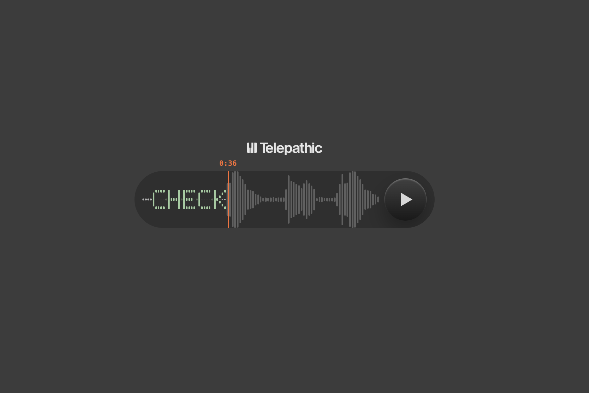

# Telepathic Audio Player

An animated audio player UI built with React + Vite. Waveform bars animate in sync with playback, and word cues render directly into the waveform as bitmap-font letters.



## Getting started

```bash
npm install
npm start
```

## Scripts

| Command | Description |
|---|---|
| `npm start` | Start dev server with HMR |
| `npm run build` | Production build |
| `npm run preview` | Serve production build locally |
| `npm run lint` | Run ESLint |
